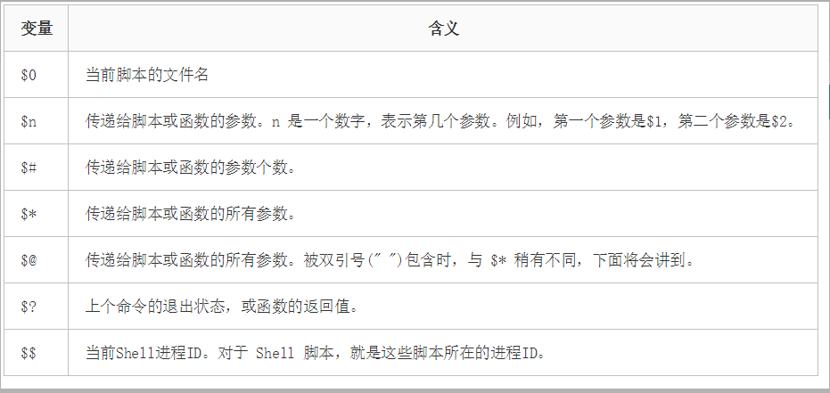
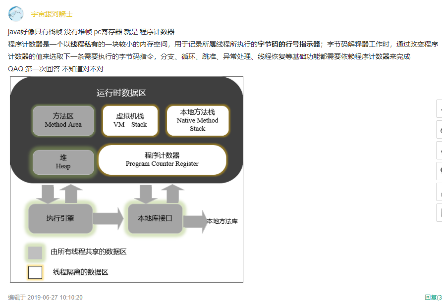

### 递归算法x(8)需要调用几次函数x(int n)？

````java
class program
 {
     static void Main(string[] args)
     {
         int i;
         i = x(8);
     }
     static int x(int n)
     {
         if (n <= 3)
             return 1;
         else
             return x(n - 2) + x(n - 4) + 1;
     }
 }
````

答：9次。

````
x(8) = x(6) + x(4) + 1 = 9;
x(6) = x(4) + x(2) +1 = 5;
x(4) = x(2) = x(0) + 1 = 3;
````

### 串的朴素模式匹配算法，主要思想是对主串(S)的每一个字符作为子串(T)开头，与要匹配的字符串进行匹配。主串(S)的长度为n，要匹配的子串的长度为m，那么朴素模式匹配算法的最坏时间复杂度为：

正确答案: C  你的答案: A (错误)

```
O((n-m)*m)
O((n＋1)*m)
O((n-m＋1)*m)
O((m＋1)*n)
```

> 最坏情况，就是每次不成功的匹配都发生在串T的最后一个字符。如：主串为S = “000000000000000000000000000000000000000000000000001”，而要匹配的子串为T = “0000000001”，前者是49个“0”和1个“1”的主串，后者是9个“0”和1个“1”的子串。每次匹配都将T中字符循环到最后一位才发现不匹配，这样等于T串要在S串的前40个位置的每个位置都要判断10次，并得出不匹配的结论，直到最后第41个位置，因为全部匹配相等，所以不需要再继续进行下去，如下图。如果最终没有可匹配的子串，比如是T =“0000000002”,到了第41位置判断不匹配后同样不需要继续比对下去。因此最坏情况比较次数为(n-m+1)*m。

每次都需要将主串中的字串和要匹配字符串的每一位进行匹配。

### 在 bash shell 环境下，当一命令正在执行时，按下 control-Z 会：

正确:C

````
中止前台任务
给当前文件加上EOF
将前台任务转入后台
注销当前用户
````

> **ctrl-c：发送 SIGINT 信号给前台进程组中的所有进程。常用于终止正在运行的程序；**
> ctrl-z：发送 SIGTSTP信号给前台进程组中的所有进程，常用于挂起一个进程；
> **ctrl-d：不是发送信号，而是表示一个特殊的二进制值，表示 EOF，作用相当于在终端中输入exit后回车；**
> ctrl-\：发送 SIGQUIT 信号给前台进程组中的所有进程，终止前台进程并生成 core 文件；
> ctrl-s：中断控制台输出；
> ctrl-q：恢复控制台输出；
> ctrl-l：清屏

### 如果ORDER BY子句后未指定ASC或DESC，默认使用以下哪个？B

````
DESC
ASC
不存在默认值
其它选项都不对
````

默认是升序的。

### 文件目录data当前权限为rwx --- ---，只需要增加用户组可读可执行权限，但不允许写操作，具体方法为：A

````
chmod+050data
chmod+040data
chmod+005data
chmod+004data
````

> 使用chomd命令改变文件权限。
>
> Linux文件基本权限有9个，owner,group,others三种身份对应各自read,write,execute三种权限。
>
> 文件权限字符：“-rwxrwxrwx”三个一组。数字化r:4 w:2 x:1
>
> 增加用户组可读，但不可写，第一组和第三组默认为0，只在第二组中添加r-x即可 chomd +050
>
> 7：表示rwx，拥有读、写和执行的权限 
>
> 6：表示rw-，拥有读和写的权限 
>
> 5：表示rx，拥有读取和执行的权限 
>
> 4：表示r--，拥有只读权限 
>
> 3：表示-wx，拥有写入和执行的权限 
>
> 2：表示-w-，拥有只写权限 
>
> 1：表示 - x，仅拥有执行权限 
>
> 0：表示---，无权限
> chmod 777 participants
> 说明：第1个7设置**用户**的权限，第2个7设置**组**的权限，第3个7设置**其他所有者**的权限。
> 题上说了data是一个目录，如果只添加只读权限，目录就进不去了。所以应该是 050

### 执行以下shell语句，可以生成/test文件的是（假定执行前没有/test文件）：ABC

````
touch /test
a=`touch /test`
>/test
echo 'touch /test'
````

B 表示转义，''中的内容会被执行，会执行touch /test 创建一个文件

C选项是输出重定向，将要输出的内容写入/test中 如果没有/test就创建一个再写入

### 以下不合法的shell头是(不合法指运行会报错)：C

````
#!/bin/bash
#-/bin/bash
!#/bin/bas
````

#表示注释

### 以下语句可以用来获取shell脚本参数的是AC

````
$1
$?
$*
$$
````



### 以下属于Redis支持的数据类型是（ ）ABCD

````
Strings
Lists
Sets
集合排序
````

> redis一共包含5种数据类型
>
> ①字符串 String （最基本的类型，可包含任意数据）
>
> ②哈希 Hash （String类型的field、value映射表）
>
> ③列表 List （字符串列表,有序不唯一）
>
> ④集合 set （字符串集合，无序唯一）
>
> ⑤集合排序 zset （字符串集合，可以通过设置分数score进行排序）

### 关于redis下面说法错误的是（）B

````
Redis主要消耗内存资源
Redis集群使用一致性hash
Redis集群之间是异步复制的
分区可以让Redis管理更大的内存
````

Redis Cluster 在设计中没有使用一致性哈希（consistency hashing）而是使用数据分片引入哈希槽hash slot实现。

### JVM内存不包含如下哪个部分( ) D

````
Stacks
PC寄存器
Heap
Heap Frame
````



### 输出结果为?：1

````java
String str = "";
System.out.println(str.split(",").length);
````

切片函数返回的是一个数组。

### java8中，下面哪个类用到了解决哈希冲突的开放定址法 C

````
LinkedHashSet
HashMap
ThreadLocal
TreeMap
````

> ThreadLocalMap通过key（ThreadLocal类型）的hashcode来计算数组存储的索引位置i。如果i位置已经存储了对象，那么就往后挪一个位置依次类推，直到找到空的位置，再将对象存放。另外，在最后还需要判断一下当前的存储的对象个数是否已经超出了阈值（threshold的值）大小，如果超出了，需要重新扩充并将所有的对象重新计算位置。